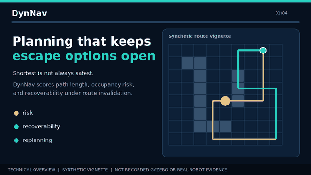

<div align="center">

# DynNav

## Planning to Preserve Escape Options

**Risk- and recoverability-aware online replanning in partially observed, dynamically changing environments.**

[](https://github.com/panagiotagrosdouli/DynNav/actions/workflows/ci.yml)
[](https://github.com/panagiotagrosdouli/DynNav/actions/workflows/contribution-experiments.yml)
[](pyproject.toml)
[](LICENSE)

[Documentation](docs/README.md) · [C01–C26 experiments](docs/CONTRIBUTIONS_26_EXPERIMENTS.md) · [PhD readiness](docs/PHD_APPLICATION_READINESS.md) · [Dashboard](app/README.md) · [Research roadmap](docs/DYNNAV_V2_RESEARCH_ROADMAP.md)

</div>

---

## System walkthrough

[](assets/dynnav_system_overview.mp4)

This 12-second deterministic walkthrough shows the implemented research landing
page, the DynNav Researcher workspace, the executable architecture, evidence
tiers, and the C01–C26 audit trail. The GIF plays directly in GitHub's README;
click it or [open the H.264 MP4 version](assets/dynnav_system_overview.mp4) for
the full-resolution video. Regenerate both assets with
`python scripts/generate_readme_video.py`.

The walkthrough is deliberately labelled as a **synthetic technical overview**.
It is generated from the repository's interface and architecture definitions;
it is not presented as recorded Gazebo or real-robot evidence.

### Current validation boundary

| Evidence tier | Current status | Reproducible location |
|---|---|---|
| Python research core | Verified by the regression and contribution suites | [`tests/`](tests/) and [`results/manifests/`](results/manifests/) |
| ROS 2 Jazzy / Nav2 plugin | CI build, grid tests, plugin discovery and install verified | [`ros2_ws/src/dynnav_nav2_cpp`](ros2_ws/src/dynnav_nav2_cpp/) |
| C01–C26 programme | 26 registered experiment contracts; dependency-aware execution | [`docs/CONTRIBUTIONS_26_EXPERIMENTS.md`](docs/CONTRIBUTIONS_26_EXPERIMENTS.md) |
| Static Gazebo benchmark | Passing retained run: 36/36 planner-server requests succeeded across six planners and two scenarios; this is path/latency evidence only | [`results/ros2_gazebo/static_run_31488640827/`](results/ros2_gazebo/static_run_31488640827/) |
| Frozen dynamic Gazebo benchmark | Passing retained `n=1` commissioning run: 8/8 valid event trials; one genuine execution timeout and no observed operational-irreversibility failures | [`results/ros2_gazebo/dynamic_run_31488640894/`](results/ros2_gazebo/dynamic_run_31488640894/) |
| Physical robot | Pending traceable rosbag/log evidence from named hardware | [`docs/PHD_APPLICATION_READINESS.md`](docs/PHD_APPLICATION_READINESS.md) |

The two web interfaces are built into one deployable portal: the research site
at `/` and the actual Researcher frontend at `/researcher`. The Researcher
frontend requires the FastAPI service for protocol compilation and experiment
execution; a static deployment alone is a presentation surface, not an
execution result.

The combined portal has a passing deployment-artifact workflow. No public URL
is claimed yet: GitHub Pages is not enabled for this repository and the
connected Vercel account does not yet contain a DynNav project.

---

## Research focus

Autonomous navigation is not only the problem of finding a collision-free or short path to a goal. In an unknown or changing environment, a locally attractive decision may place the robot in a state from which safe retreat, recovery, or replanning is no longer feasible.

DynNav studies one focused question:

> **Can explicit recoverability estimation reduce irreversible navigation failures during online replanning without imposing excessive path-length and computation overhead?**

The project develops and evaluates navigation methods that jointly reason about:

- geometric path cost;
- occupancy and traversal risk;
- preservation of escape and return options;
- route invalidation caused by newly observed or dynamic obstacles;
- online replanning after the environment changes.

The central principle is:

> **A planner should evaluate not only whether a decision moves the robot toward the goal, but also whether that decision preserves enough safe options for reacting when the environment changes.**

---

## Core contribution

DynNav combines three capabilities into one experimental navigation framework:

1. **Risk-aware planning** — avoid routes with excessive collision or occupancy exposure.
2. **Recoverability-aware planning** — penalize states that reduce safe retreat, escape, or future replanning options.
3. **Dynamic replanning** — update the route when observations or obstacles invalidate the current plan.

The intended planner objective is:

```text
J(path) = length(path)
        + lambda_risk * risk(path)
        + lambda_irr  * irreversibility(path)
```

where:

- `length(path)` measures geometric or traversal cost;
- `risk(path)` measures cumulative or local occupancy-related exposure;
- `irreversibility(path)` measures the loss of safe future options.

A state-level irreversibility model may use measurable quantities such as:

```text
I(state) = w_escape     / (1 + escape_options(state))
         + w_bottleneck * bottleneck_exposure(state)
         + w_return     * return_failure_probability(state)
```

The exact formulation, normalization, and weights are treated as experimental variables rather than universal constants.

---

## Scientific hypotheses

The project evaluates the following hypotheses:

- **H1:** Recoverability-aware planning reduces irreversible navigation failures relative to shortest-path and risk-only planning.
- **H2:** Its benefit increases as route invalidation and environmental change become more likely.
- **H3:** The reduction in failures can be achieved with bounded path-length and planning-time overhead.
- **H4:** Joint risk and recoverability reasoning outperforms either component used in isolation.

These hypotheses are evaluated through controlled scenarios, repeated seeded experiments, ablations, sensitivity analysis, and explicit failure reporting.

---

## Experimental comparison

DynNav compares four planner configurations under identical maps, seeds, starts, goals, and obstacle events.

| Configuration | Objective |
|---|---|
| **Shortest** | geometric path cost only |
| **Risk-aware** | length + occupancy risk |
| **Recoverability-aware** | length + irreversibility |
| **Joint planner** | length + risk + irreversibility |

The minimum ablation set is:

```text
J0 = L
J1 = L + lambda_risk * R
J2 = L + lambda_irr  * I
J3 = L + lambda_risk * R + lambda_irr * I
```

Each objective term must have documented units or normalization, value ranges, zero-weight behavior, logging semantics, and deterministic tests.

---

## Evaluation scenarios

The core benchmark suite focuses on environments where shortest-path reasoning can produce brittle or irreversible decisions:

- dead ends and cul-de-sacs;
- narrow passages and bottlenecks;
- two-corridor maps with unequal recovery options;
- sudden route closure after the robot commits to a corridor;
- moving obstacles that block retreat;
- partially observed maps revealed during execution;
- repeated block-and-clear cycles during online replanning.

A representative stress test is:

> The shortest route enters a narrow corridor. After commitment, a new observation or dynamic obstacle blocks the exit. A longer alternative route would have preserved multiple escape and recovery options.

---

## Primary metrics

The main evaluation metrics are:

- mission success rate;
- irreversible failure rate;
- recovery success rate;
- emergency-stop rate;
- minimum escape-option count;
- number of replans;
- path-length overhead;
- cumulative risk exposure;
- planning and replanning time.

The principal outcome is:

```text
irreversible_failure_rate =
    runs_without_a_feasible_safe_exit / total_runs
```

The central trade-off is the reduction in irreversible failures relative to additional path length and computation.

---

## Repository structure

```text
scenario, map, observations, dynamic obstacle events
        ↓
occupancy, risk, and recoverability representation
        ↓
shortest / risk-aware / recoverability-aware / joint planning
        ↓
route monitoring and online replanning
        ↓
mission outcome, failure reason, metrics, and experiment artifacts
```

The repository includes deterministic planning foundations, risk and recoverability components, incremental replanning experiments, tests, experiment scripts, reports, and an interactive dashboard.

The broader collection of exploratory modules remains available in the [extended research module catalog](docs/CONTRIBUTION_FEATURE_CATALOG.md). Those modules are supporting extensions and are not the primary scientific claim of the project.

---

## Current implementation base

The repository already contains foundations used by the focused research program:

- typed grid, pose, trajectory, and mission primitives;
- deterministic A* and Dijkstra baselines;
- risk-aware grid planning;
- risk and uncertainty fields;
- returnability and recoverability experiments;
- D* Lite incremental replanning;
- repeated obstacle block/clear and moving-start regression tests;
- deterministic experiment entry points and exportable artifacts;
- an interactive Streamlit research laboratory.

The research program is active and implementation-driven. Individual claims are considered established only when they are connected to executable code, tests, reproducible experiments, and stored quantitative results.

---

## Reproducibility requirements

Every reported experiment should provide:

- a documented command;
- deterministic seed support;
- machine-readable configuration;
- CSV or JSON results;
- exact planner parameters;
- baseline comparisons;
- failure-reason reporting;
- dependency and commit information;
- multi-seed aggregate statistics;
- generated tables or figures.

A result is not treated as complete evidence when it is available only as a dashboard visualization or a single demonstration run.

---

## Installation

```bash
git clone https://github.com/panagiotagrosdouli/DynNav.git
cd DynNav
python -m venv .venv
source .venv/bin/activate
python -m pip install --upgrade pip
python -m pip install -e ".[dev,dashboard]"
```

Windows PowerShell:

```powershell
.venv\Scripts\Activate.ps1
python -m pip install --upgrade pip
python -m pip install -e ".[dev,dashboard]"
```

---

## Run the project

Launch the evidence-bound DynNav Researcher vertical slice:

```bash
python -m pip install -e ".[researcher]"
python -m uvicorn apps.api.main:app --reload --port 8000
```

In a second terminal:

```bash
cd apps/web
npm install
npm run dev
```

Open `http://localhost:3000`. The Researcher compiles a natural-language request into an editable typed protocol, then
runs the existing four-planner Python experiment only after explicit confirmation. Numerical results, statistics, and the
downloadable Markdown report remain unavailable until real execution artifacts exist. See the
[Researcher architecture and roadmap](docs/DYNNAV_RESEARCHER_ARCHITECTURE.md).

Build both web interfaces as one static deployment artifact:

```bash
npm --prefix website ci --no-audit --no-fund
npm --prefix apps/web ci --no-audit --no-fund
bash scripts/build_web_portal.sh
python -m http.server 4173 --directory .web-dist
```

Open `http://localhost:4173/` for the research site and
`http://localhost:4173/researcher/` for the Researcher frontend. The root
[`vercel.json`](vercel.json) uses the same deterministic build.

The Streamlit laboratory remains available as the legacy research interface:

Launch the interactive laboratory:

```bash
streamlit run app/dashboard.py
```

Run the available benchmark and demonstration entry points:

```bash
dynnav-demo
dynnav-benchmark
python scripts/run_all.py
python scripts/run_benchmarks.py
```

Run the test suite:

```bash
python -m pytest -q
```

---

## ROS 2 Jazzy / Nav2 plugin

The repository includes a C++17 Nav2 global-planner plugin in
[`ros2_ws/src/dynnav_nav2_cpp`](ros2_ws/src/dynnav_nav2_cpp/README.md). It reads
the global costmap, performs deterministic risk- and local-irreversibility-aware
A*, supports cancellation, and returns a `nav_msgs/msg/Path` through the Jazzy
`nav2_core::GlobalPlanner` API.

```bash
source /opt/ros/jazzy/setup.bash
rosdep install \
  --from-paths ros2_ws/src/dynnav_nav2_cpp \
  --ignore-src --rosdistro jazzy -r -y
colcon build \
  --base-paths ros2_ws/src/dynnav_nav2_cpp \
  --packages-select dynnav_nav2_cpp
source install/setup.bash
colcon test --packages-select dynnav_nav2_cpp
colcon test-result --verbose
```

The standard GitHub workflow builds and tests the plugin in a ROS 2 Jazzy
container. A separate manual workflow launches the official minimal TurtleBot3
Gazebo Harmonic simulation and runs a paired static planner-server benchmark:

```bash
ros2 launch dynnav_nav2_benchmark \
  tb3_static_planner_benchmark.launch.py \
  headless:=true repetitions:=10 \
  output_dir:=$PWD/results/nav2_static
```

Its six configurations are NavFn, Smac 2D, and four DynNav ablations. It stores
raw requests, paths, failures, hashes, parameters, and environment versions.
The retained [static commissioning run](results/ros2_gazebo/static_run_31488640827/)
passed on branch head `253e3b3`: all 36 measured requests succeeded across two
scenarios, three repetitions, and six planners. Raw paths, trial rows, map and
parameter snapshots, package versions, and SHA-256 manifests are committed.
This static test cannot establish dynamic irreversible-failure reduction. See
the [protocol](docs/GAZEBO_BENCHMARK_PROTOCOL.md) and [integration evidence
status](docs/ROS2_NAV2_INTEGRATION.md).

The repository also contains a frozen dynamic-execution harness. It teleports
the simulated robot to a controlled start, executes `NavigateToPose`, injects a
physical Gazebo blocker at a declared navigation time, archives the resulting
global costmap, and evaluates return reachability with a planner-independent
grid oracle. Its workflow intentionally fails on invalid event delivery while
preserving genuine negative outcomes. The retained [dynamic commissioning
run](results/ros2_gazebo/dynamic_run_31488640894/) passed its measurement
contract with 8/8 valid trials and blocker observation in every trial. It
recorded one genuine `DynNavJoint` execution timeout, seven navigation
successes, and no operational-irreversibility failures for any planner. This
single repetition is a valid negative smoke result, not evidence that DynNav
reduces irreversible failure. See the [dynamic execution
protocol](docs/DYNAMIC_EXECUTION_PROTOCOL.md).

---

## Research roadmap

The focused development sequence is:

1. define and validate the units, ranges, and normalization of every objective term;
2. distinguish expected risk, maximum risk, VaR, and empirical CVaR where used;
3. formalize escape options, returnability, bottleneck exposure, and irreversible failure;
4. integrate recoverability costs with incremental online replanning;
5. build deterministic dynamic bottleneck scenarios;
6. run fair four-way planner ablations;
7. add multi-seed statistics, confidence intervals, and effect sizes;
8. generate publication-quality tables, plots, and failure-case analyses;
9. expand the now-passing static and frozen-dynamic Gazebo commissioning runs
   into a powered paired study before moving to physical platforms.

The detailed implementation roadmap remains available in [`docs/DYNNAV_V2_RESEARCH_ROADMAP.md`](docs/DYNNAV_V2_RESEARCH_ROADMAP.md).

---

## Evidence boundaries

DynNav is a real research software project, but scientific conclusions must follow the available evidence.

Current repository results are primarily based on deterministic and stochastic synthetic navigation environments. They do not by themselves establish certified safety, universal generalization, production readiness, or physical-robot reliability.

The Nav2 plugin implementation is separate from experimental validation. ROS 2
CI, simulation-scale validation, physical-robot experiments, and formal safety
guarantees are distinct evidence tiers and must not be reported as completed
until their reproducible artifacts exist.

---

## Extended modules

Previous and exploratory work on uncertainty calibration, prediction, supervision, learning, human-aware navigation, multi-robot coordination, security, semantic representations, formal methods, and other extensions is preserved in:

- [C01–C26 hypothesis, baseline, metric, command, and limitation catalogue](docs/CONTRIBUTIONS_26_EXPERIMENTS.md)
- [Contribution feature catalog](docs/CONTRIBUTION_FEATURE_CATALOG.md)
- [Contribution source index](contributions/CONTRIBUTIONS_README.md)
- [Documentation index](docs/README.md)
- [Interactive dashboard guide](app/README.md)

Run one controlled smoke experiment for every registered contribution with:

```bash
python scripts/validate_contribution_registry.py
python scripts/run_contribution_suite.py --output-dir results/contribution_suite
```

The suite stores CSV artifacts plus a JSON manifest and SHA-256 digest for each executed experiment. Optional dependencies are reported as explicit skips; they are never counted as scientific passes.

These components may support future experiments, but the primary DynNav contribution is **risk- and recoverability-aware online replanning that preserves safe escape options under dynamic route invalidation**.

---

## License

DynNav is released under the [Apache License 2.0](LICENSE).
