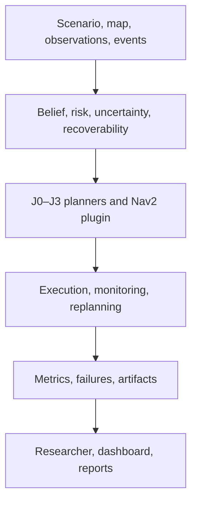

<div align="center">

# DynNav

## Planning to Preserve Escape Options

**An evidence-first robotics research platform for risk- and recoverability-aware online replanning in partially observed, dynamically changing environments.**

[](https://github.com/panagiotagrosdouli/DynNav/actions/workflows/ci.yml)
[](https://github.com/panagiotagrosdouli/DynNav/actions/workflows/contribution-experiments.yml)
[](pyproject.toml)
[](ros2_ws/src/dynnav_nav2_cpp/README.md)
[](CLAIM_EVIDENCE_MATRIX.md)
[](LICENSE)

[**English**](README.md) · [Ελληνικά](README_GR.md)

[Research dossier](docs/PHD_APPLICATION_READINESS.md) · [Claim–evidence matrix](CLAIM_EVIDENCE_MATRIX.md) · [Experiment protocol](EXPERIMENT_PROTOCOL_V2.md) · [Documentation](docs/README.md)

</div>

<p align="center">
  <a href="assets/dynnav_system_overview.mp4">
    
  </a>
</p>

> This is a real execution trace of the canonical Python J3 planner. At step 5,
> an occupancy update blocks the initial route; the displayed path and telemetry
> are rendered directly from `OnlineRecoverabilityPlanner` records. It is a
> deterministic software simulation, not Gazebo or physical-robot footage.

---

## The idea in 30 seconds

The shortest collision-free path can still be a brittle decision. A robot may
enter a narrow corridor, commit to a single-exit region, or consume its last
safe retreat option just before a new obstacle invalidates the route.

DynNav asks:

> **Can a planner preserve useful escape and recovery options during online
> replanning, while keeping path-length and computation overhead bounded?**

The repository turns that question into executable software:

- four controlled planning objectives, from shortest-only to joint
  risk/recoverability reasoning;
- deterministic and paired multi-seed experiments;
- operational failure, recovery, overhead, and uncertainty metrics;
- a C++17 ROS 2 Jazzy/Nav2 global-planner plugin;
- static and dynamic Gazebo benchmark harnesses;
- a FastAPI + Next.js research workspace;
- a thirteen-page Streamlit robotics laboratory;
- 26 registered exploratory research-module experiments;
- CI, tests, manifests, hashes, reports, and explicit claim boundaries.

DynNav is a **research prototype**, not a certified safety system. The
[claim–evidence matrix](CLAIM_EVIDENCE_MATRIX.md) is the source of truth for
what the current results do and do not support.

---

## What DynNav does

| Capability | What is implemented | Where to inspect it |
|---|---|---|
| Classical planning | Deterministic A*, Dijkstra, grid and mission primitives | [`dynnav/planners`](dynnav/planners/) and [`dynnav/core`](dynnav/core/) |
| Risk-aware planning | Occupancy/costmap exposure terms and configurable risk-weighted search | [`dynnav/risk.py`](dynnav/risk.py), [`dynnav/planning.py`](dynnav/planning.py) |
| Recoverability-aware planning | Local escape-option, returnability, bottleneck, and recovery-oriented experiments | [`dynnav/recoverability.py`](dynnav/recoverability.py), [`dynnav/planners`](dynnav/planners/) |
| Dynamic replanning | D* Lite, online route monitoring, moving-start and repeated block/clear experiments | [`dynnav/planners/recoverability_dstar_lite.py`](dynnav/planners/recoverability_dstar_lite.py), [`dynnav/monitoring.py`](dynnav/monitoring.py) |
| Scientific evaluation | Paired planners, multi-seed runs, bootstrap summaries, Wilson intervals, effect and overhead metrics | [`dynnav/experiments`](dynnav/experiments/), [`dynnav/evaluation`](dynnav/evaluation/) |
| ROS 2 / Nav2 | Lifecycle-aware C++ global-planner plugin with cancellation, costmap snapshots, parameters, tests, and plugin discovery | [`dynnav_nav2_cpp`](ros2_ws/src/dynnav_nav2_cpp/) |
| Gazebo experiments | Static planner-server benchmark and frozen dynamic route-invalidation harness | [`dynnav_nav2_benchmark`](ros2_ws/src/dynnav_nav2_benchmark/), [retained runs](results/ros2_gazebo/) |
| DynNav Researcher | Natural-language request → typed protocol → explicit confirmation → real execution → checksummed artifacts | [architecture](docs/DYNNAV_RESEARCHER_ARCHITECTURE.md), [API](apps/api/), [web app](apps/web/) |
| Interactive laboratory | Scenario building, planner comparison, belief/risk layers, dynamic obstacles, experiments, replay, exports, and system status | [Streamlit lab](app/README.md) |
| Extended research programme | 26 controlled experiment contracts across learning, uncertainty, security, mapping, multi-robot systems, and AI-assisted navigation | [programme](docs/CONTRIBUTIONS_26_EXPERIMENTS.md), [catalogue](docs/CONTRIBUTION_FEATURE_CATALOG.md) |

### Extended research areas

The extended modules are preserved as independently inspectable prototypes; they
are not all evidence for the central DynNav claim.

| Area | Examples |
|---|---|
| Planning and learning | learned A*, hybrid planning, belief-risk planning, PPO, curriculum RL |
| Uncertainty and recovery | calibration, CVaR, irreversibility, returnability, safe-mode navigation |
| Perception and mapping | next-best view, visual odometry, diffusion occupancy, NeRF, Gaussian splatting |
| Distributed autonomy | energy/connectivity planning, multi-robot coordination, swarm consensus |
| Security and trust | innovation-based IDS, attack simulation, causal attribution, federated learning |
| Human and AI interaction | language constraints, ethics/trust, VLM navigation, LLM mission planning, failure explanation |
| Formal and emerging methods | formal safety shields, topological-semantic maps, neuromorphic sensing |

---

## System architecture



The Python research core is the source of numerical synthetic experiments. The
Nav2 plugin is the ROS integration path. The web and Streamlit interfaces
configure, execute, inspect, and export evidence; they do not manufacture
numerical results.

---

## Research core

The smallest controlled comparison uses four objectives under identical maps,
seeds, start/goal states, and obstacle events:

| ID | Planner objective | Question |
|---|---|---|
| **J0** | \(L\) | What does shortest-only planning do? |
| **J1** | \(L + \lambda_R R\) | What changes when occupancy risk is penalized? |
| **J2** | \(L + \lambda_Q(1-Q)\) | What changes when local escape/recovery options are preserved? |
| **J3** | \(L + \lambda_R R + \lambda_Q(1-Q)\) | Does joint reasoning improve the trade-off? |

The current Nav2 transition cost is:

```text
c(s) = neutral_cost
     + risk_weight * normalized_costmap_cost(s)
     + irreversibility_weight * local_irreversibility(s)
```

`local_irreversibility` is an interpretable structural heuristic based on
four-connected escape options and bottleneck exposure. It is **not** a
calibrated probability, formal viability result, or proof of safety. Validating
a robot-information-conditioned recovery-feasibility estimator is a central
remaining research task.

### Scientific hypotheses

- **H1:** recoverability-aware planning reduces post-invalidation,
  recovery-infeasible failures relative to shortest-only and risk-only planning;
- **H2:** its benefit increases as route invalidation and environmental
  uncertainty become more important;
- **H3:** any reduction is achieved within frozen path-length and replanning
  latency margins;
- **H4:** joint risk and recoverability reasoning helps in aligned conditions
  and exposes an interpretable trade-off in conflict conditions.

These are hypotheses, not conclusions. The
[V2 protocol](EXPERIMENT_PROTOCOL_V2.md) defines the scenarios, seed splits,
validity rules, estimands, statistical tests, artifact contract, and submission
gates required to evaluate them.

---

## Evidence at a glance

| Evidence tier | Current repository evidence | Interpretation |
|---|---|---|
| Python research core | Regression suite across Python 3.10–3.12; deterministic and randomized planner tests | Verifies implemented software contracts |
| Controlled C01–C26 suite | Dependency-aware experiment registry with machine-readable results and explicit skips | Exploratory synthetic evidence |
| ROS 2 Jazzy / Nav2 | CI build, known-answer grid tests, pluginlib discovery, and installation checks | Integration evidence; not robot efficacy |
| Static Gazebo run | 36/36 planner-server requests across six planners and two scenarios | Path/latency commissioning evidence only |
| Dynamic Gazebo run | 8/8 valid event trials, seven mission successes, one timeout, no observed recovery-infeasible failures | `n=1` protocol commissioning; not a treatment-effect estimate |
| Physical robot | Hardware launch and safety checklist exist; no named hardware run with traceable logs/rosbag | Unsupported until executed |

Retained raw artifacts, environment snapshots, configurations, trial rows, and
SHA-256 manifests are under [`results/ros2_gazebo`](results/ros2_gazebo/).

### Ten-minute reviewer path

1. Read the [research and engineering dossier](docs/PHD_APPLICATION_READINESS.md).
2. Inspect the [smallest publishable core](CORE_CONTRIBUTION.md).
3. Check every claim in the [claim–evidence matrix](CLAIM_EVIDENCE_MATRIX.md).
4. Review the [failure and falsification suite](FAILURE_CASES.md).
5. Open the executable [scientific metrics](dynnav/evaluation/scientific_metrics.py) and [their tests](tests/test_scientific_metrics.py).
6. Inspect the [Nav2 plugin](ros2_ws/src/dynnav_nav2_cpp/) and [retained Gazebo evidence](results/ros2_gazebo/).

---

## Quick start

### 1. Install

```bash
git clone https://github.com/panagiotagrosdouli/DynNav.git
cd DynNav
python -m venv .venv
source .venv/bin/activate
python -m pip install --upgrade pip
python -m pip install -e ".[dev,researcher,dashboard]"
```

Windows PowerShell activation:

```powershell
.venv\Scripts\Activate.ps1
python -m pip install --upgrade pip
python -m pip install -e ".[dev,researcher,dashboard]"
```

### 2. Run a reproducible smoke experiment

```bash
python scripts/run_all.py \
  --config configs/default.yaml \
  --smoke \
  --out-dir results/quickstart
```

The run writes metrics, trajectory/risk figures, video/GIF output, an evaluation
report, and a reproducibility report beneath the selected output directory.

### 3. Compare the planner family

```bash
python scripts/run_benchmarks.py \
  --config configs/default.yaml \
  --smoke \
  --out-dir results/quick_benchmark
```

The declared output directory contains each planner run plus the aggregate CSV
and Markdown report.

### 4. Verify the checkout

```bash
ruff check dynnav ros2_ws/src/dynnav_nav2_benchmark
mypy dynnav/mapping --strict --no-warn-unused-ignores --show-error-codes
python -m pytest -q
python scripts/audit_markdown.py \
  --root . \
  --json-out results/markdown_audit.json
```

---

## Run the research interfaces

### DynNav Researcher — FastAPI + Next.js

Start the evidence-bound API:

```bash
python -m uvicorn apps.api.main:app --reload --port 8000
```

In a second terminal:

```bash
npm --prefix apps/web ci --no-audit --no-fund
npm --prefix apps/web run dev
```

Open `http://localhost:3000`. A research request becomes an editable typed
protocol. Execution requires explicit confirmation, and numerical result blocks
remain unavailable until real artifacts exist.

### Streamlit robotics laboratory

```bash
streamlit run app/dashboard.py
```

Open `http://localhost:8501`. The laboratory includes scenario construction,
planner arenas, belief/mapping inspection, risk and safety layers, dynamic
obstacles, multi-robot concepts, contribution explorers, experiment studios,
results/replay, documentation, and runtime status.

### Unified static web portal

```bash
npm --prefix website ci --no-audit --no-fund
npm --prefix apps/web ci --no-audit --no-fund
bash scripts/build_web_portal.sh
python -m http.server 4173 --directory .web-dist
```

Open `http://localhost:4173/` for the project site and
`http://localhost:4173/researcher/` for the static Researcher surface. Static
hosting is a presentation layer; experiment execution still requires the API.

---

## ROS 2 Jazzy / Nav2

The canonical ROS package is a C++17 `nav2_core::GlobalPlanner` plugin. It
snapshots the global costmap under its mutex, validates frames and bounds,
supports cancellation, rejects lethal goals, exposes risk/irreversibility
weights, and returns a stamped `nav_msgs/msg/Path`.

```bash
source /opt/ros/jazzy/setup.bash
rosdep install \
  --from-paths ros2_ws/src/dynnav_nav2_cpp \
  --ignore-src --rosdistro jazzy -r -y

colcon build \
  --base-paths ros2_ws/src/dynnav_nav2_cpp \
  --packages-select dynnav_nav2_cpp
source install/setup.bash
colcon test --packages-select dynnav_nav2_cpp
colcon test-result --verbose
```

Static planner-server benchmark:

```bash
ros2 launch dynnav_nav2_benchmark \
  tb3_static_planner_benchmark.launch.py \
  headless:=true repetitions:=10 \
  output_dir:=$PWD/results/nav2_static
```

Frozen dynamic route-invalidation benchmark:

```bash
ros2 launch dynnav_nav2_benchmark \
  tb3_dynamic_execution_benchmark.launch.py \
  headless:=true record_bag:=true repetitions:=100 \
  output_dir:=$PWD/results/nav2_dynamic
```

See the [Nav2 plugin guide](ros2_ws/src/dynnav_nav2_cpp/README.md),
[Gazebo protocol](docs/GAZEBO_BENCHMARK_PROTOCOL.md), and
[dynamic protocol](docs/DYNAMIC_EXECUTION_PROTOCOL.md) before interpreting the
outputs.

---

## Reproducibility contract

A reportable DynNav experiment should retain:

- source commit, dirty-tree state, exact command, and configuration hash;
- deterministic seed and planner parameters;
- map, world, start/goal, event, and environment snapshots;
- raw per-trial CSV/JSON, including failures and invalid trials;
- initial and replanned paths, costmaps, timestamps, and ROS logs where relevant;
- package versions, container/environment identity, and artifact SHA-256 hashes;
- analysis command, statistical assumptions, and generated figure manifests.

Failed and partial trials remain visible. A dashboard screenshot or single
demonstration is not treated as scientific evidence.

---

## Repository map

```text
dynnav/                           canonical Python research package
  core/                           typed navigation primitives
  planners/                       A*, risk, recoverability, D* Lite
  experiments/                    scenarios, paired and multi-seed studies
  evaluation/                     metrics and statistics
  researcher/                     protocols, orchestration, reports, API

ros2_ws/src/
  dynnav_nav2_cpp/                C++17 Nav2 global-planner plugin
  dynnav_nav2_benchmark/          static and dynamic Gazebo experiments
  dynnav_turtlebot3/              TurtleBot3 simulation/hardware bringup

apps/api/                         FastAPI entry point
apps/web/                         Next.js Researcher workspace
app/                              Streamlit robotics laboratory
website/                          public research landing page
contributions/                    extended C01–C26 research prototypes
configs/                          reproducible experiment configurations
scripts/                          runners, validators, audits, generators
tests/                            Python regression and research-contract tests
results/                          retained evidence and generated artifacts
docs/                             scientific and engineering documentation
paper/                            manuscript and publication planning
```

---

## Technology

Python · NumPy · SciPy · Pandas · Pydantic · FastAPI · Streamlit · Next.js ·
TypeScript · C++17 · ROS 2 Jazzy · Nav2 · Gazebo Harmonic · Pytest · Ruff ·
Mypy · Docker · GitHub Actions

---

## Scientific boundaries

DynNav currently does **not** claim:

- certified safety or formal verification;
- universal superiority over NavFn, Smac, or other planners;
- a calibrated probability of recoverability;
- production readiness;
- physical-robot reliability;
- generalization beyond the evaluated maps, events, seeds, and configurations.

The main credibility milestone is a powered, preregistered dynamic study with
executed recovery labels—not another unrelated module. Physical-robot work
should follow only after the simulation protocol and safety gates are stable.

---

## Roadmap

1. validate a recovery-feasibility estimator on held-out executed recoveries;
2. freeze tuning/evaluation splits and complete the powered V2 study;
3. rerun all six ROS planners with direct replan logs, rosbags, and immutable manifests;
4. publish effect sizes, confidence intervals, failure cases, and overhead trade-offs;
5. conduct a staged, named TurtleBot3 experiment with conservative limits and traceable evidence;
6. consolidate remaining duplicate package and generated-artifact layouts.

See the [publication plan](PUBLICATION_PLAN.md) and
[research roadmap](docs/DYNNAV_V2_RESEARCH_ROADMAP.md).

---

## Contributing, citation, and license

- Contributions: [`CONTRIBUTING.md`](CONTRIBUTING.md)
- Responsible disclosure: [`SECURITY.md`](SECURITY.md)
- Citation metadata: [`CITATION.cff`](CITATION.cff)
- Code of conduct: [`CODE_OF_CONDUCT.md`](CODE_OF_CONDUCT.md)

DynNav is released under the [Apache License 2.0](LICENSE).
