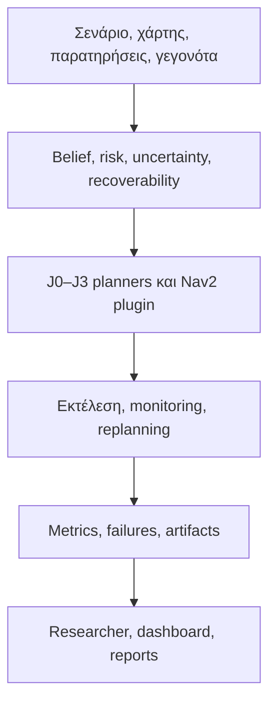

<div align="center">

# DynNav

## Σχεδιασμός που διατηρεί επιλογές ασφαλούς διαφυγής

**Μια τεκμηριοκεντρική ερευνητική πλατφόρμα ρομποτικής για online επανασχεδιασμό με επίγνωση κινδύνου και δυνατότητας ανάκαμψης σε δυναμικά, μερικώς παρατηρήσιμα περιβάλλοντα.**

[](https://github.com/panagiotagrosdouli/DynNav/actions/workflows/ci.yml)
[](https://github.com/panagiotagrosdouli/DynNav/actions/workflows/contribution-experiments.yml)
[](pyproject.toml)
[](ros2_ws/src/dynnav_nav2_cpp/README.md)
[](CLAIM_EVIDENCE_MATRIX.md)
[](LICENSE)

[English](README.md) · [**Ελληνικά**](README_GR.md)

[Ερευνητικός φάκελος](docs/PHD_APPLICATION_READINESS.md) · [Πίνακας ισχυρισμών–τεκμηρίων](CLAIM_EVIDENCE_MATRIX.md) · [Πειραματικό πρωτόκολλο](EXPERIMENT_PROTOCOL_V2.md) · [Τεκμηρίωση](docs/README.md)

</div>

<p align="center">
  <a href="assets/dynnav_system_overview.mp4">
    
  </a>
</p>

> Η κινούμενη επισκόπηση παράγεται ντετερμινιστικά από τα interfaces και την
> αρχιτεκτονική του repository. Δεν παρουσιάζεται ως καταγραφή από Gazebo ή
> φυσικό ρομπότ.

---

## Η ιδέα σε 30 δευτερόλεπτα

Η συντομότερη διαδρομή χωρίς σύγκρουση μπορεί να είναι εύθραυστη επιλογή. Ένα
ρομπότ μπορεί να μπει σε στενό διάδρομο, να δεσμευτεί σε περιοχή με μία έξοδο ή
να χάσει την τελευταία ασφαλή οδό υποχώρησης λίγο πριν ένα νέο εμπόδιο ακυρώσει
την αρχική διαδρομή.

Το DynNav εξετάζει το ερώτημα:

> **Μπορεί ένας planner να διατηρεί χρήσιμες επιλογές διαφυγής και ανάκαμψης
> κατά τον online επανασχεδιασμό, με ελεγχόμενο πρόσθετο μήκος διαδρομής και
> υπολογιστικό κόστος;**

Το repository μετατρέπει το ερώτημα σε εκτελέσιμο ερευνητικό λογισμικό:

- τέσσερα ελεγχόμενα objectives, από shortest-only έως κοινή εκτίμηση
  κινδύνου και δυνατότητας ανάκαμψης,
- ντετερμινιστικά και paired multi-seed πειράματα,
- λειτουργικούς ορισμούς αποτυχίας, ανάκαμψης, overhead και αβεβαιότητας,
- C++17 global-planner plugin για ROS 2 Jazzy/Nav2,
- static και dynamic Gazebo benchmark harnesses,
- ερευνητικό workspace με FastAPI και Next.js,
- εργαστήριο ρομποτικής δεκατριών σελίδων σε Streamlit,
- 26 καταχωρισμένα πειράματα εξερευνητικών ερευνητικών modules,
- CI, tests, manifests, hashes, reports και σαφή όρια ισχυρισμών.

Το DynNav είναι **ερευνητικό πρωτότυπο**, όχι πιστοποιημένο σύστημα ασφάλειας. Ο
[πίνακας ισχυρισμών–τεκμηρίων](CLAIM_EVIDENCE_MATRIX.md) είναι η κανονική πηγή
για το τι υποστηρίζουν και τι δεν υποστηρίζουν τα σημερινά αποτελέσματα.

---

## Τι κάνει το DynNav

| Δυνατότητα | Τι έχει υλοποιηθεί | Πού βρίσκεται |
|---|---|---|
| Κλασικός σχεδιασμός | Ντετερμινιστικά A*, Dijkstra και typed primitives για grid και αποστολές | [`dynnav/planners`](dynnav/planners/) και [`dynnav/core`](dynnav/core/) |
| Risk-aware planning | Όροι έκθεσης σε occupancy/costmap risk και search με ρυθμιζόμενο βάρος κινδύνου | [`dynnav/risk.py`](dynnav/risk.py), [`dynnav/planning.py`](dynnav/planning.py) |
| Recoverability-aware planning | Πειράματα με επιλογές διαφυγής, returnability, bottlenecks και ανάκαμψη | [`dynnav/recoverability.py`](dynnav/recoverability.py), [`dynnav/planners`](dynnav/planners/) |
| Δυναμικός επανασχεδιασμός | D* Lite, παρακολούθηση διαδρομής, moving-start και επαναλαμβανόμενα block/clear πειράματα | [`recoverability_dstar_lite.py`](dynnav/planners/recoverability_dstar_lite.py), [`monitoring.py`](dynnav/monitoring.py) |
| Επιστημονική αξιολόγηση | Paired planners, multi-seed runs, bootstrap summaries, Wilson intervals, effect και overhead metrics | [`dynnav/experiments`](dynnav/experiments/), [`dynnav/evaluation`](dynnav/evaluation/) |
| ROS 2 / Nav2 | Lifecycle-aware C++ global-planner plugin με cancellation, costmap snapshots, parameters, tests και plugin discovery | [`dynnav_nav2_cpp`](ros2_ws/src/dynnav_nav2_cpp/) |
| Πειράματα Gazebo | Static planner-server benchmark και frozen dynamic route-invalidation harness | [`dynnav_nav2_benchmark`](ros2_ws/src/dynnav_nav2_benchmark/), [διατηρημένα runs](results/ros2_gazebo/) |
| DynNav Researcher | Αίτημα φυσικής γλώσσας → typed protocol → ρητή επιβεβαίωση → πραγματική εκτέλεση → checksummed artifacts | [αρχιτεκτονική](docs/DYNNAV_RESEARCHER_ARCHITECTURE.md), [API](apps/api/), [web app](apps/web/) |
| Διαδραστικό εργαστήριο | Δημιουργία σεναρίων, σύγκριση planners, belief/risk layers, δυναμικά εμπόδια, experiments, replay και exports | [Streamlit lab](app/README.md) |
| Εκτεταμένο ερευνητικό πρόγραμμα | 26 ελεγχόμενα experiment contracts σε learning, uncertainty, security, mapping, multi-robot και AI-assisted navigation | [πρόγραμμα](docs/CONTRIBUTIONS_26_EXPERIMENTS.md), [κατάλογος](docs/CONTRIBUTION_FEATURE_CATALOG.md) |

### Εκτεταμένες ερευνητικές περιοχές

Τα πρόσθετα modules διατηρούνται ως ανεξάρτητα εξερευνητικά πρωτότυπα. Δεν
αποτελούν όλα τεκμήρια για τον κεντρικό ισχυρισμό του DynNav.

| Περιοχή | Παραδείγματα |
|---|---|
| Planning και learning | learned A*, hybrid planning, belief-risk planning, PPO, curriculum RL |
| Αβεβαιότητα και ανάκαμψη | calibration, CVaR, irreversibility, returnability, safe-mode navigation |
| Perception και mapping | next-best view, visual odometry, diffusion occupancy, NeRF, Gaussian splatting |
| Κατανεμημένη αυτονομία | energy/connectivity planning, multi-robot coordination, swarm consensus |
| Ασφάλεια και εμπιστοσύνη | innovation-based IDS, attack simulation, causal attribution, federated learning |
| Άνθρωπος και AI | language constraints, ethics/trust, VLM navigation, LLM mission planning, failure explanation |
| Formal και αναδυόμενες μέθοδοι | formal safety shields, topological-semantic maps, neuromorphic sensing |

---

## Αρχιτεκτονική συστήματος



Ο Python research core είναι η πηγή των αριθμητικών synthetic experiments. Το
Nav2 plugin αποτελεί τη διαδρομή ενσωμάτωσης στο ROS. Τα web και Streamlit
interfaces ρυθμίζουν, εκτελούν, επιθεωρούν και εξάγουν τεκμήρια· δεν δημιουργούν
αυθαίρετα αριθμητικά αποτελέσματα.

---

## Ερευνητικός πυρήνας

Η μικρότερη ελεγχόμενη σύγκριση χρησιμοποιεί τέσσερα objectives στους ίδιους
χάρτες, seeds, start/goal states και obstacle events:

| ID | Objective planner | Ερευνητικό ερώτημα |
|---|---|---|
| **J0** | \(L\) | Τι επιλέγει ο shortest-only planner; |
| **J1** | \(L + \lambda_R R\) | Τι αλλάζει όταν τιμωρείται το occupancy risk; |
| **J2** | \(L + \lambda_Q(1-Q)\) | Τι αλλάζει όταν διατηρούνται τοπικές επιλογές διαφυγής/ανάκαμψης; |
| **J3** | \(L + \lambda_R R + \lambda_Q(1-Q)\) | Βελτιώνει τον συμβιβασμό η κοινή εκτίμηση; |

Το σημερινό transition cost του Nav2 plugin είναι:

```text
c(s) = neutral_cost
     + risk_weight * normalized_costmap_cost(s)
     + irreversibility_weight * local_irreversibility(s)
```

Το `local_irreversibility` είναι μια ερμηνεύσιμη δομική heuristic που βασίζεται
σε four-connected επιλογές διαφυγής και έκθεση σε bottleneck. **Δεν** είναι
βαθμονομημένη πιθανότητα, αποτέλεσμα formal viability ή απόδειξη ασφάλειας. Η
επικύρωση ενός estimator της εφικτότητας ανάκαμψης, ο οποίος χρησιμοποιεί μόνο
πληροφορία διαθέσιμη στο ρομπότ, παραμένει κεντρική ερευνητική εργασία.

### Επιστημονικές υποθέσεις

- **H1:** το recoverability-aware planning μειώνει τις post-invalidation
  recovery-infeasible failures σε σχέση με shortest-only και risk-only planning,
- **H2:** το όφελος αυξάνεται όταν η ακύρωση διαδρομής και η περιβαλλοντική
  αβεβαιότητα γίνονται σημαντικότερες,
- **H3:** οποιαδήποτε μείωση επιτυγχάνεται εντός προκαθορισμένων ορίων για
  path-length και replanning latency,
- **H4:** η κοινή εκτίμηση risk και recoverability βοηθά στις aligned συνθήκες
  και αποκαλύπτει ερμηνεύσιμο trade-off στις conflict συνθήκες.

Πρόκειται για υποθέσεις, όχι για συμπεράσματα. Το
[πρωτόκολλο V2](EXPERIMENT_PROTOCOL_V2.md) ορίζει σενάρια, seed splits,
κριτήρια εγκυρότητας, estimands, στατιστικούς ελέγχους, artifact contract και
submission gates.

---

## Η σημερινή τεκμηρίωση με μία ματιά

| Επίπεδο τεκμηρίων | Τι υπάρχει σήμερα | Σωστή ερμηνεία |
|---|---|---|
| Python research core | Regression suite σε Python 3.10–3.12, deterministic και randomized planner tests | Επαληθεύει τα υλοποιημένα software contracts |
| Controlled suite C01–C26 | Dependency-aware experiment registry με machine-readable results και ρητά skips | Εξερευνητικά synthetic τεκμήρια |
| ROS 2 Jazzy / Nav2 | CI build, known-answer grid tests, pluginlib discovery και installation checks | Τεκμήρια ενσωμάτωσης, όχι απόδοσης ρομπότ |
| Static Gazebo run | 36/36 planner-server requests σε έξι planners και δύο σενάρια | Αρχική τεκμηρίωση path/latency μόνο |
| Dynamic Gazebo run | 8/8 έγκυρα event trials, επτά επιτυχίες αποστολής, ένα timeout, καμία παρατηρημένη recovery-infeasible failure | Commissioning με `n=1`, όχι εκτίμηση treatment effect |
| Φυσικό ρομπότ | Υπάρχουν hardware launch και safety checklist, αλλά όχι επώνυμο hardware run με traceable logs/rosbag | Μη υποστηριζόμενος ισχυρισμός μέχρι να εκτελεστεί |

Τα διατηρημένα raw artifacts, environment snapshots, configurations, trial
rows και SHA-256 manifests βρίσκονται στο
[`results/ros2_gazebo`](results/ros2_gazebo/).

### Διαδρομή αξιολόγησης δέκα λεπτών

1. Διάβασε τον [ερευνητικό και τεχνικό φάκελο](docs/PHD_APPLICATION_READINESS.md).
2. Έλεγξε τον [μικρότερο δημοσιεύσιμο πυρήνα](CORE_CONTRIBUTION.md).
3. Έλεγξε κάθε claim στον [πίνακα ισχυρισμών–τεκμηρίων](CLAIM_EVIDENCE_MATRIX.md).
4. Δες το [failure και falsification suite](FAILURE_CASES.md).
5. Άνοιξε τα εκτελέσιμα [scientific metrics](dynnav/evaluation/scientific_metrics.py) και [τα tests τους](tests/test_scientific_metrics.py).
6. Επιθεώρησε το [Nav2 plugin](ros2_ws/src/dynnav_nav2_cpp/) και τα [διατηρημένα Gazebo τεκμήρια](results/ros2_gazebo/).

---

## Γρήγορη εκκίνηση

### 1. Εγκατάσταση

```bash
git clone https://github.com/panagiotagrosdouli/DynNav.git
cd DynNav
python -m venv .venv
source .venv/bin/activate
python -m pip install --upgrade pip
python -m pip install -e ".[dev,researcher,dashboard]"
```

Ενεργοποίηση σε Windows PowerShell:

```powershell
.venv\Scripts\Activate.ps1
python -m pip install --upgrade pip
python -m pip install -e ".[dev,researcher,dashboard]"
```

### 2. Αναπαραγώγιμο smoke experiment

```bash
python scripts/run_all.py \
  --config configs/default.yaml \
  --smoke \
  --out-dir results/quickstart
```

Το run γράφει metrics, trajectory/risk figures, video/GIF output, evaluation
report και reproducibility report κάτω από τον επιλεγμένο φάκελο.

### 3. Σύγκριση της οικογένειας planners

```bash
python scripts/run_benchmarks.py \
  --config configs/default.yaml \
  --smoke \
  --out-dir results/quick_benchmark
```

Ο δηλωμένος output directory περιέχει κάθε planner run μαζί με το συνολικό CSV
και το Markdown report.

### 4. Επαλήθευση του checkout

```bash
ruff check dynnav ros2_ws/src/dynnav_nav2_benchmark
mypy dynnav/mapping --strict --no-warn-unused-ignores --show-error-codes
python -m pytest -q
python scripts/audit_markdown.py \
  --root . \
  --json-out results/markdown_audit.json
```

---

## Εκτέλεση των ερευνητικών interfaces

### DynNav Researcher — FastAPI + Next.js

Εκκίνηση του evidence-bound API:

```bash
python -m uvicorn apps.api.main:app --reload --port 8000
```

Σε δεύτερο terminal:

```bash
npm --prefix apps/web ci --no-audit --no-fund
npm --prefix apps/web run dev
```

Άνοιξε το `http://localhost:3000`. Ένα ερευνητικό αίτημα μετατρέπεται σε
επεξεργάσιμο typed protocol. Η εκτέλεση απαιτεί ρητή επιβεβαίωση και τα numerical
result blocks παραμένουν μη διαθέσιμα μέχρι να υπάρχουν πραγματικά artifacts.

### Εργαστήριο ρομποτικής Streamlit

```bash
streamlit run app/dashboard.py
```

Άνοιξε το `http://localhost:8501`. Το εργαστήριο περιλαμβάνει scenario
construction, planner arenas, επιθεώρηση belief/mapping, risk και safety layers,
dynamic obstacles, multi-robot concepts, contribution explorers, experiment
studios, results/replay, documentation και runtime status.

### Ενοποιημένο static web portal

```bash
npm --prefix website ci --no-audit --no-fund
npm --prefix apps/web ci --no-audit --no-fund
bash scripts/build_web_portal.sh
python -m http.server 4173 --directory .web-dist
```

Άνοιξε το `http://localhost:4173/` για το project site και το
`http://localhost:4173/researcher/` για το static Researcher surface. Το static
hosting είναι presentation layer· η εκτέλεση πειραμάτων εξακολουθεί να απαιτεί
το API.

---

## ROS 2 Jazzy / Nav2

Το κανονικό ROS package είναι C++17 `nav2_core::GlobalPlanner` plugin. Παίρνει
snapshot του global costmap κάτω από το mutex του, ελέγχει frames και bounds,
υποστηρίζει cancellation, απορρίπτει lethal goals, εκθέτει weights για risk και
irreversibility και επιστρέφει stamped `nav_msgs/msg/Path`.

```bash
source /opt/ros/jazzy/setup.bash
rosdep install \
  --from-paths ros2_ws/src/dynnav_nav2_cpp \
  --ignore-src --rosdistro jazzy -r -y

colcon build \
  --base-paths ros2_ws/src/dynnav_nav2_cpp \
  --packages-select dynnav_nav2_cpp
source install/setup.bash
colcon test --packages-select dynnav_nav2_cpp
colcon test-result --verbose
```

Static planner-server benchmark:

```bash
ros2 launch dynnav_nav2_benchmark \
  tb3_static_planner_benchmark.launch.py \
  headless:=true repetitions:=10 \
  output_dir:=$PWD/results/nav2_static
```

Frozen dynamic route-invalidation benchmark:

```bash
ros2 launch dynnav_nav2_benchmark \
  tb3_dynamic_execution_benchmark.launch.py \
  headless:=true record_bag:=true repetitions:=100 \
  output_dir:=$PWD/results/nav2_dynamic
```

Δες τον [οδηγό του Nav2 plugin](ros2_ws/src/dynnav_nav2_cpp/README.md), το
[πρωτόκολλο Gazebo](docs/GAZEBO_BENCHMARK_PROTOCOL.md) και το
[dynamic protocol](docs/DYNAMIC_EXECUTION_PROTOCOL.md) πριν ερμηνεύσεις τα
outputs.

---

## Συμβόλαιο αναπαραγωγιμότητας

Ένα δημοσιεύσιμο πείραμα DynNav πρέπει να διατηρεί:

- source commit, dirty-tree state, ακριβή εντολή και configuration hash,
- deterministic seed και planner parameters,
- map, world, start/goal, event και environment snapshots,
- raw per-trial CSV/JSON, μαζί με failures και invalid trials,
- initial και replanned paths, costmaps, timestamps και ROS logs όπου απαιτούνται,
- package versions, container/environment identity και SHA-256 hashes,
- analysis command, statistical assumptions και manifests των παραγόμενων figures.

Τα failed και partial trials παραμένουν ορατά. Ένα dashboard screenshot ή ένα
μεμονωμένο demonstration δεν θεωρείται επιστημονικό τεκμήριο.

---

## Χάρτης του repository

```text
dynnav/                           κανονικό Python research package
  core/                           typed navigation primitives
  planners/                       A*, risk, recoverability, D* Lite
  experiments/                    scenarios, paired και multi-seed studies
  evaluation/                     metrics και statistics
  researcher/                     protocols, orchestration, reports, API

ros2_ws/src/
  dynnav_nav2_cpp/                C++17 Nav2 global-planner plugin
  dynnav_nav2_benchmark/          static και dynamic Gazebo experiments
  dynnav_turtlebot3/              TurtleBot3 simulation/hardware bringup

apps/api/                         FastAPI entry point
apps/web/                         Next.js Researcher workspace
app/                              Streamlit robotics laboratory
website/                          public research landing page
contributions/                    extended C01–C26 research prototypes
configs/                          reproducible experiment configurations
scripts/                          runners, validators, audits, generators
tests/                            Python regression και research-contract tests
results/                          retained evidence και generated artifacts
docs/                             scientific και engineering documentation
paper/                            manuscript και publication planning
```

---

## Τεχνολογίες

Python · NumPy · SciPy · Pandas · Pydantic · FastAPI · Streamlit · Next.js ·
TypeScript · C++17 · ROS 2 Jazzy · Nav2 · Gazebo Harmonic · Pytest · Ruff ·
Mypy · Docker · GitHub Actions

---

## Επιστημονικά όρια

Το DynNav σήμερα **δεν** ισχυρίζεται:

- πιστοποιημένη ασφάλεια ή formal verification,
- καθολική υπεροχή έναντι NavFn, Smac ή άλλων planners,
- βαθμονομημένη πιθανότητα recoverability,
- production readiness,
- αξιοπιστία σε φυσικό ρομπότ,
- γενίκευση πέρα από τους χάρτες, τα events, τα seeds και τα configurations που
  αξιολογήθηκαν.

Το επόμενο σημαντικό ορόσημο αξιοπιστίας είναι μια preregistered dynamic μελέτη
επαρκούς στατιστικής ισχύος με executed recovery labels — όχι άλλο ένα άσχετο
module. Η εργασία σε φυσικό ρομπότ πρέπει να ακολουθήσει μόνο όταν σταθεροποιηθεί
το simulation protocol και τα safety gates.

---

## Roadmap

1. επικύρωση recovery-feasibility estimator σε held-out executed recoveries,
2. πάγωμα tuning/evaluation splits και ολοκλήρωση της powered V2 μελέτης,
3. επανεκτέλεση και των έξι ROS planners με direct replan logs, rosbags και immutable manifests,
4. δημοσίευση effect sizes, confidence intervals, failure cases και overhead trade-offs,
5. σταδιακό, επώνυμο TurtleBot3 experiment με συντηρητικά όρια και traceable evidence,
6. ενοποίηση των υπόλοιπων duplicate package και generated-artifact layouts.

Δες το [publication plan](PUBLICATION_PLAN.md) και το
[research roadmap](docs/DYNNAV_V2_RESEARCH_ROADMAP.md).

---

## Συνεισφορά, citation και άδεια

- Οδηγός συνεισφοράς: [`CONTRIBUTING.md`](CONTRIBUTING.md)
- Responsible disclosure: [`SECURITY.md`](SECURITY.md)
- Citation metadata: [`CITATION.cff`](CITATION.cff)
- Code of conduct: [`CODE_OF_CONDUCT.md`](CODE_OF_CONDUCT.md)

Το DynNav διατίθεται με την [Apache License 2.0](LICENSE).
