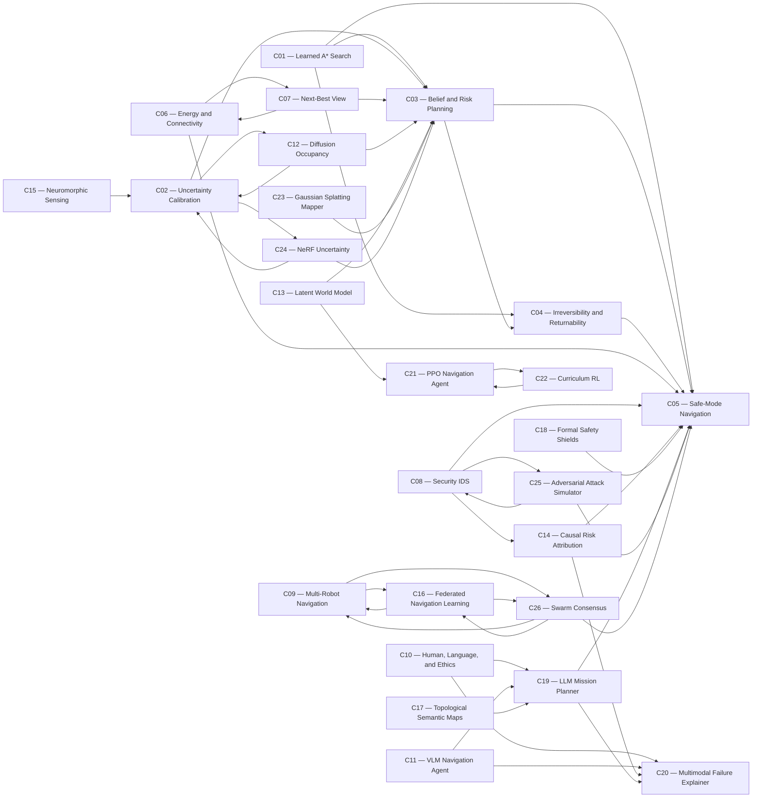

# DynNav Contribution Dependency Graph

> Generated from `configs/contributions/registry.yaml`. Relationships indicate intended integration, not experimental validation.

## Adjacency list

- **C01 — Learned A* Search:** [C03](../contributions/03_belief_risk_planning/README.md), [C04](../contributions/04_irreversibility_returnability/README.md), [C05](../contributions/05_safe_mode_navigation/README.md)
- **C02 — Uncertainty Calibration:** [C03](../contributions/03_belief_risk_planning/README.md), [C12](../contributions/12_diffusion_occupancy/README.md), [C24](../contributions/24_nerf_uncertainty/README.md)
- **C03 — Belief and Risk Planning:** [C04](../contributions/04_irreversibility_returnability/README.md), [C05](../contributions/05_safe_mode_navigation/README.md)
- **C04 — Irreversibility and Returnability:** [C05](../contributions/05_safe_mode_navigation/README.md)
- **C05 — Safe-Mode Navigation:** None declared
- **C06 — Energy and Connectivity:** [C05](../contributions/05_safe_mode_navigation/README.md), [C07](../contributions/07_next_best_view/README.md)
- **C07 — Next-Best View:** [C03](../contributions/03_belief_risk_planning/README.md), [C06](../contributions/06_energy_connectivity/README.md)
- **C08 — Security IDS:** [C05](../contributions/05_safe_mode_navigation/README.md), [C14](../contributions/14_causal_risk_attribution/README.md), [C25](../contributions/25_adversarial_attack_simulator/README.md)
- **C09 — Multi-Robot Navigation:** [C16](../contributions/16_federated_nav_learning/README.md), [C26](../contributions/26_swarm_consensus/README.md)
- **C10 — Human, Language, and Ethics:** [C19](../contributions/19_llm_mission_planner/README.md), [C20](../contributions/20_multimodal_failure_explainer/README.md)
- **C11 — VLM Navigation Agent:** [C19](../contributions/19_llm_mission_planner/README.md), [C20](../contributions/20_multimodal_failure_explainer/README.md)
- **C12 — Diffusion Occupancy:** [C02](../contributions/02_uncertainty_calibration/README.md), [C03](../contributions/03_belief_risk_planning/README.md)
- **C13 — Latent World Model:** [C03](../contributions/03_belief_risk_planning/README.md), [C21](../contributions/21_ppo_navigation_agent/README.md)
- **C14 — Causal Risk Attribution:** [C05](../contributions/05_safe_mode_navigation/README.md), [C20](../contributions/20_multimodal_failure_explainer/README.md)
- **C15 — Neuromorphic Sensing:** [C02](../contributions/02_uncertainty_calibration/README.md)
- **C16 — Federated Navigation Learning:** [C09](../contributions/09_multi_robot/README.md), [C26](../contributions/26_swarm_consensus/README.md)
- **C17 — Topological Semantic Maps:** [C19](../contributions/19_llm_mission_planner/README.md)
- **C18 — Formal Safety Shields:** [C05](../contributions/05_safe_mode_navigation/README.md)
- **C19 — LLM Mission Planner:** [C05](../contributions/05_safe_mode_navigation/README.md), [C20](../contributions/20_multimodal_failure_explainer/README.md)
- **C20 — Multimodal Failure Explainer:** None declared
- **C21 — PPO Navigation Agent:** [C22](../contributions/22_curriculum_rl/README.md)
- **C22 — Curriculum RL:** [C21](../contributions/21_ppo_navigation_agent/README.md)
- **C23 — Gaussian Splatting Mapper:** [C03](../contributions/03_belief_risk_planning/README.md)
- **C24 — NeRF Uncertainty:** [C02](../contributions/02_uncertainty_calibration/README.md), [C03](../contributions/03_belief_risk_planning/README.md)
- **C25 — Adversarial Attack Simulator:** [C08](../contributions/08_security_ids/README.md), [C05](../contributions/05_safe_mode_navigation/README.md)
- **C26 — Swarm Consensus:** [C09](../contributions/09_multi_robot/README.md), [C16](../contributions/16_federated_nav_learning/README.md), [C05](../contributions/05_safe_mode_navigation/README.md)
