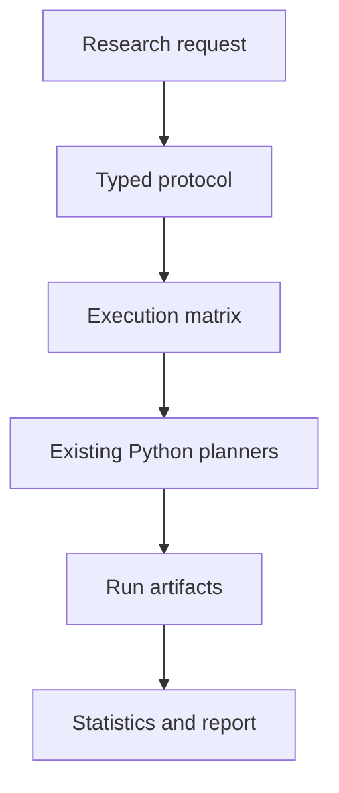

# DynNav Researcher architecture

## Purpose

DynNav Researcher is an incremental product layer over the existing navigation research code. It does not replace or
reimplement the planners. Its first vertical slice turns a natural-language research request into an inspectable protocol,
executes the four canonical objective ablations on paired seeded scenarios, and publishes only artifact-backed numerical
results.

## Repository architecture summary

The repository currently contains four distinct architectural areas:

| Area | Current implementation | Reusable capability |
|---|---|---|
| Focused navigation domain | `dynnav/planners`, `dynnav/recoverability.py` | Grid maps, four risk/recoverability A* modes, auditable path metrics |
| Focused experiments | `dynnav/experiments` | Deterministic scenario generation, multi-seed execution, bootstrap intervals, paired effects |
| Installed research package | `src/dynnav` | General navigation primitives, mapping, safety, research modules, ROS 2 helpers |
| Research UI | `app`, `src/dynnav_dashboard` | Thirteen Streamlit laboratory pages and deterministic two-planner demonstrations |
| Existing web prototypes | `website`, `vercel_app` | Small Next.js informational/demo surfaces without experiment orchestration |
| Extended research modules | `contributions`, `research_experiments`, `ros2_ws` | Broad exploratory work outside the focused four-planner claim |

The focused runner already compares `shortest`, `risk_aware`, `recoverability_aware`, and `proposed` modes. It applies the
same seed and scenario generator to every planner and computes descriptive statistics, bootstrap intervals, and paired
effects.

## Gap analysis

| Target capability | Previous state | Vertical-slice state | Remaining gap |
|---|---|---|---|
| Unified researcher workspace | Fragmented Streamlit pages | Three-panel Next.js workspace | Persisted multi-session library and all six full modules |
| Natural-language protocol | No shared typed protocol | Deterministic, transparent protocol compiler | Model-assisted tool calling with approval policy |
| Typed experiment schema | Page-local dictionaries | Pydantic `ExperimentSpecification` and related contracts | Shared generated TypeScript package |
| Four-planner fair comparison | Focused Python runner only | Service-level execution matrix with deterministic run IDs | Dynamic-event and named-scenario families |
| Live progress | Streamlit loop-local progress | Pollable status plus server-sent progress events | Durable distributed worker and resumable queue |
| Artifact provenance | CSV/JSON in selected scripts | Checksummed config, matrix, runs, statistics, report, manifest, and ZIP | Object storage and metadata database |
| Evidence boundaries | Notices on selected pages | API/UI/report state gates and explicit unsupported-claim notices | Model output policy tests across a production AI provider |
| Reproducible report | Session-local Markdown | Downloadable artifact-backed Markdown report | HTML/PDF rendering and richer plots |
| Scenario editor and replay | Separate lab pages | Typed scenario inspector | Interactive layers, event schedule, synchronized replay |
| Packaging | Two top-level Python package roots | Documented checkout service path | Consolidation into one installable `src/dynnav` package |

The dual Python package roots (`dynnav` and `src/dynnav`) are the most important migration risk. The focused planner and
experiment code currently lives in the repository-root package, while the wheel configuration installs `src/dynnav`.
The slice therefore runs from the repository checkout. A later migration must consolidate these packages without copying
planner logic or changing established imports silently.

## Proposed monorepo and service architecture

```text
apps/
  web/                         Next.js researcher workspace
  api/                         FastAPI ASGI entry point
dynnav/
  planners/                    Existing focused source-of-truth planners
  experiments/                 Existing deterministic runners and statistics
  researcher/                  Typed protocols, orchestration, API, reports
packages/
  experiment-schema/           Future generated TypeScript contracts
  ui/                          Future reusable research blocks
artifacts/
  researcher/<experiment-id>/  Deterministic experiment artifact tree
app/                           Legacy Streamlit research laboratory
```

The request flow is:



The Python backend remains the sole source of numerical experiment evidence. The web application may render a configured
run count or objective weight before execution, but it receives result metrics only after the service reaches `completed`
or `partial` evidence status.

## Service contracts in the first slice

| Endpoint | Role |
|---|---|
| `GET /health` | Liveness and evidence-policy identity |
| `GET /v1/capabilities` | Executable planners, scenario families, metrics, and unsupported evidence |
| `GET /v1/system` | Source revision and execution environment |
| `POST /v1/protocols` | Compile a natural-language request into a typed, unexecuted specification |
| `POST /v1/experiments` | Validate and register an immutable configuration version |
| `POST /v1/experiments/{id}/run` | Explicitly enqueue a real execution matrix |
| `GET /v1/experiments/{id}` | Read structured progress and current evidence status |
| `GET /v1/experiments/{id}/events` | Stream server-sent progress events |
| `GET /v1/experiments/{id}/results` | Read results only after executed evidence exists |
| `GET /v1/experiments/{id}/artifacts/{name}` | Download a whitelisted checksummed artifact |

## Reproducibility and evidence policy

Every run records its experiment, scenario, planner, seed, status, timestamps, configuration hash, outcome, metrics, and
error state. The final manifest records:

- Git commit and dirty-tree state;
- Python, operating system, and dependency versions;
- exact configuration and scenario hashes;
- seed and planner lists;
- result and artifact SHA-256 hashes;
- a checkout-valid reproduction command.

Configured experiments expose no result summary. Partial failures remain visible as failed run records; they are not
silently discarded. Reports label hypotheses, observations, exploratory comparisons, execution errors, and unsupported
physical-world claims separately.

## Implementation roadmap

### Phase 1 — completed vertical slice

- typed research, scenario, planner, execution, result, artifact, and reproducibility contracts;
- deterministic natural-language protocol compilation;
- four-planner paired execution with live structured progress;
- artifact persistence, checksums, exploratory statistics, and Markdown report;
- unified responsive Research Workspace with editable visual and JSON configuration;
- focused model, orchestration, provenance, partial-failure, and API contract tests.

### Phase 2 — orchestration durability

- consolidate the two Python package roots;
- add SQLite/PostgreSQL metadata and restart-safe state loading;
- add a durable worker interface, cancellation, retry, resume, and concurrency limits;
- introduce named static and dynamic scenario families with versioned event schedules;
- record trajectory and map-layer artifacts for synchronized replay.

### Phase 3 — full product surfaces

- implement the Experiments, Scenarios, Results, Research Library, and System modules;
- add interactive scenario editing, scientific charts, map layers, and failure replay;
- add HTML/PDF report rendering and artifact-library search;
- generate TypeScript clients and schemas from the OpenAPI contract.

### Phase 4 — AI researcher

- connect an AI model only through the explicit service tools;
- require confirmation for configuration-changing and execution actions;
- restrict numerical statements to cited artifact IDs;
- persist versioned sessions, interpretations, and tool calls;
- add adversarial tests that prevent fabricated result blocks and unsupported claims.

### Phase 5 — validation and deployment

- expand accessibility, frontend state, load, and security testing;
- add containerized API/worker/web deployment and object storage;
- measure planner throughput and progress-stream backpressure;
- document separate synthetic, Gazebo, ROS 2, and physical-robot evidence tiers.

